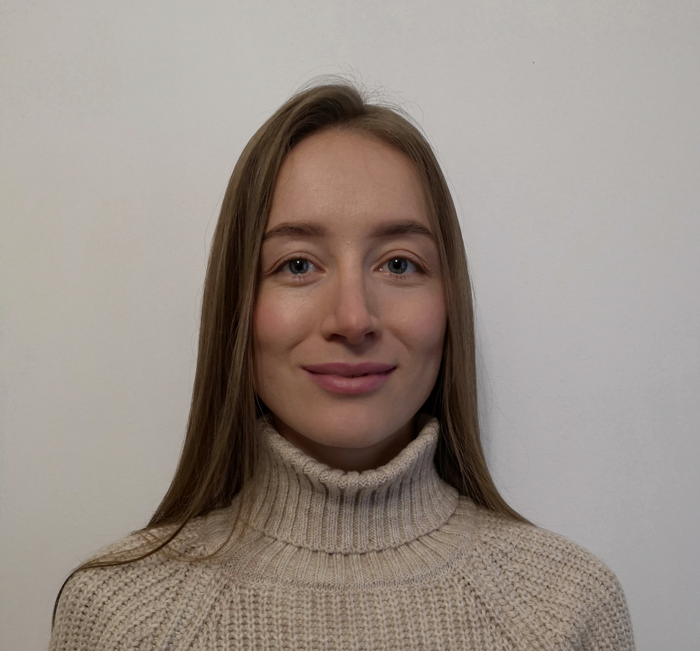

#**ALIAKSANDRA SINITSYNA**

##**CONTACT**

a.sinitsyna07@gmail.com

##**PROFILE**

There is a great desire to realize myself in a new profession at a high level, to gain experience in order to move further and higher.

##**SKILLS**

* HTML
* CSS
* Figma

##**EDUCATION**

HTMLAcademy June-July 2022
HTML and CSS. Professional web site makeup

##**MY PROJECTS**

[https://sinichka22.github.io/my_projects/Sedona/](адрес "My projects Sedona")

##**WORK EXPERIENCE**

Project Sedona was fully developed, the following technologies were used for execution: HTML, CSS, cross-platform and pixel-perfect layout, Figma.

##**LANGUAGES**

English language level A2
in the learning process